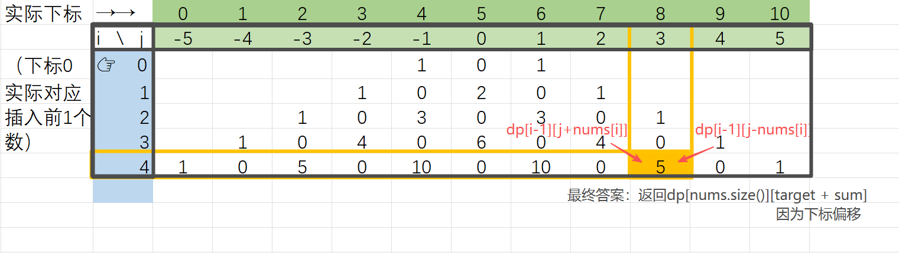

# 易于理解：二维 DP 模拟正负号选择，结果范围为 [-sum, sum]

原题解：[LeetCode 494. 目标和](https://leetcode.cn/problems/target-sum/solutions/4039154/yi-yu-li-jie-de-zhi-jie-mo-ni-zheng-fu-h-s6yv)

> Problem: [494. 目标和](https://leetcode.cn/problems/target-sum/description/)

# 思路

> 这里给出我的思考过程，展示整体解题思路，具体细节实现在解题过程部分
> 这里下标便于理解，用[-sum，sum]，解题部分讲解实际应用如何偏移

#### 定义dp数组

 动态规划的题理解dp数组的含义十分重要，这里定义二维数组`dp[i][j]`，表示前`i`个数添加正负号，运算结果得到 `j` 的方案数目

#### 确定递推公式

由示例的数组，在本子上列表格寻找规律：

发现想要得到当前这一层的实际运算结果`j`，有两种方案：加上当前数 `nums[i]`，或者减去当前数 `nums[i]` 。

那么我们可以就要从上一轮（前i-1个数）里找运算结果为` j-nums[i]`和`j+nums[i]`的即可

所以我们得到递推公式`dp[i][j] = dp[i-1][j-nums[i]] + dp[i-1][j+nums[i]`

#### 初始化

只需初始化第一行（下标0）即可，第一个数既可以是正也可以是负，所以把`dp[0][-nums[i]]`和`dp[0][nums[i]]`初始化为`1`（拿一个数，得到+该数的情况是一种，－该数的情况也只是一种）

#### 遍历顺序

二维数组从前到后遍历即可

#### 举例推导dp数组

示例 `nums = [1,1,1,1,1], target = 3`



os：数组全是1的时候，dp数组不就是杨辉三角么

# 解题过程

> 这里根据已有思路给出具体实现，一步步把思路转化成代码

先拿到数组和sum

```cpp
int sum = 0;
for(int i = 0; i < nums.size(); i++)sum += nums[i];
```

如果目标超出区间[-sum，sum]直接返回0

```cpp
if(abs(target) > sum) return 0;
```

还记得dp数组的定义吗，我们要在代码中实现：

这里有点讨厌的是下标不能为负，所以我们需要偏移`j`的下标从`[-sum, sum]`到`[0, 2*sum+1]`

定义数组时下标`i`从`0`到`nums.size()`；`j`从`0`到 `2*sum+1`

```cpp
vector<vector<int>> dp(nums.size(), vector<int>(2*sum+1, 0));
```

并且这里有初始化为`0`

在初始化下标`0`的行，这里注意，如果`nums[0] = 0`，sum+-0结果还是sum，同一个下标会重复赋值为1，所以要用`+=`，区分`+0，-0`两种方案

```cpp
dp[0][sum + nums[0]] += 1;
dp[0][sum - nums[0]] += 1;
```

接下来就是遍历dp数组了，i为0已经初始化了，直接从1开始遍历，j在`[0, 2*sum+1]`遍历

写递推时加上`if`判断用来保护数组下标

```cpp
for(int i = 1; i < nums.size(); i++){
    for(int j = 0; j < 2*sum+1; j++){
        if(j - nums[i] >= 0)dp[i][j] += dp[i - 1][j - nums[i]];
        if(j + nums[i] <= 2*sum) dp[i][j] += dp[i - 1][j + nums[i]];
    }
}
```

真实目标 target 映射到数组下标`target+sum`，取处理完全部数字后的`dp[nums.size()-1][target+sum]`作为答案

```cpp
return dp[nums.size() - 1][target + sum];
```

# 复杂度

- 时间复杂度: $O(n*sum)$
- 空间复杂度: $O(n*sum)$

# Code

```cpp
class Solution {
public:
    int findTargetSumWays(vector<int>& nums, int target) {
        int sum = 0;
        for(int i = 0; i < nums.size(); i++)sum += nums[i];
        if(abs(target) > sum) return 0;
        //1.dp[i][j]数组含义：前i个数添加正负号，运算结果得到j的方案数目
        vector<vector<int>> dp(nums.size(), vector<int>(2*sum+1, 0));
        //2.递推公式：dp[i][j] = dp[i - 1][j - nums[i]] + dp[i - 1][j + nums[i]];
        //3.初始化：
        dp[0][sum + nums[0]] += 1;
        dp[0][sum - nums[0]] += 1;
        //4.遍历顺序：从前向后
        for(int i = 1; i < nums.size(); i++){
            for(int j = 0; j < 2*sum+1; j++){
                if(j - nums[i] >= 0)dp[i][j] += dp[i - 1][j - nums[i]];
                if(j + nums[i] <= 2*sum) dp[i][j] += dp[i - 1][j + nums[i]];
            }
        }
        return dp[nums.size() - 1][target + sum];
    }
};
```

> 本人写下本题解时是仅仅是刷了129道力扣题的小白，思路和代码并未成熟，题解仅供大家参考，希望给予大家帮助，欢迎大佬指点思路、提出见解 org
